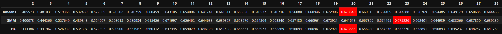

# Programa de Fidelidade

Identificar os melhores clientes como Insiders

## 1.	Problema de negócio
A empresa All in One Place é uma empresa Outlet Multimarcas, ou seja, ela comercializa produtos de segunda linha de várias marcas a um preço menor, através de um e-commerce.
Em pouco mais de 1 ano de operação, o time de marketing percebeu que alguns clientes da sua base, compram produtos mais caros, com alta frequência e acabam contribuindo com uma parcela significativa do faturamento da empresa.
Baseado nesta percepção, o time de marketing que lançar um programa de fidelidade para os melhores clientes da base, intitulado Insiders. Mas o time não tem um conhecimento avançado em análise de dados para eleger os participantes do programa.
Por este motivo, o time de marketing requisitou ao time da dados uma seleção de clientes elegíveis ao programa, usando técnicas avançadas de manipulação de dados.

## 2.	Objetivo
Determinar quem são os clientes elegíveis para participar do programa Insiders para que o time de marketing possa direcionar a ações personalizadas e exclusivas a este grupo, de modo a aumentar o faturamento e frequência de compra.

## 3.	Premissas do negócio
Para assegurar que o comportamento da variável "customer_id" fosse registrado, mesmo em linhas com dados faltantes, foi adotada uma abordagem na qual essas lacunas foram preenchidas utilizando o valor máximo encontrado na variável "customer_id", acrescido de uma unidade. Por exemplo, se o maior valor de "customer_id" encontrado é 18.999, então a primeira linha sem um valor para "customer_id" seria preenchida com 18.999 + 1, resultando em 19.000. Esse procedimento foi repetido para todas as linhas onde "customer_id" estava ausente, seguindo essa lógica de incremento sequencial.
Além disso, optou-se por remover as linhas da variável "stock_code" contendo as informações: 'POST', 'D', 'DOT', 'M', 'S', 'AMAZONFEE', 'm', 'DCGSSBOY', 'DCGSSGIRL', 'PADS', 'B', 'CRUK', pois estas não contribuíam significativamente para a análise dos dados, sugerindo a presença de ruído nos dados.

## 4.	Estratégia adotada para solução

Passo 1 - Descrição dos dados: O objetivo deste passo é ter um entendimento inicial de como os dados estão relacionados com o problema de negócio proposto, para tal, lançando mão de algumas métricas estatísticas de posição e distribuição.

Passo 2 - Engenharia de atributos: Neste passo foram criadas novas variáveis a partir das variáveis originais a fim de melhorar a qualidade dos dados facilitando seu o entendimento.

Passo 3 - Filtragem das variáveis: No processo de filtragem, busca-se selecionar e reter apenas as variáveis relevantes para a análise ou modelagem, com base nos objetivos do negócio e nas características do problema em questão.
 
Passo 4 - Análise exploratória: A análise exploratória dos dados (EDA) tem como principal objetivo proporcionar uma compreensão mais aprofundada dos dados, tais como: Compreender a distribuição das variáveis numéricas e categóricas, identificar outliers (valores atípicos), se existe desbalanceamento da variável resposta, correlações entre as variáveis entre outras análises.

Passo 5 - Preparação dos dados: Neste tópico, os dados serão transformados, ou seja, as variáveis categóricas serão convertidas em números, pois os algoritmos de machine learning não tem uma boa performance com dados não numéricos. Os dados também precisarão ser reescalados, ou seja, colocar as variáveis em uma escala comum.
 
Passo 6 - Seleção das variáveis: Neste passo o principal objetivo é selecionar as variáveis mais relevantes e descartar as menos importantes, para que estas sejam submetidas aos algoritmos de machine learning. Esta seleção é feita através de algoritmos específicos de seleção, com isso, busca-se reduzir a dimensionalidade dos dados sem perder em performance ao resultado final.

Passo 7 - Algoritmos de machine learning: Serão implementados alguns modelos de algoritmos de machine learning para possamos escolher o que melhor performou com os dados disponíveis.
 
Passo 8 - Ajuste dos hiperparâmetros: Com a definição do melhor modelo de machine learning, busca-se otimizar ainda mais a performance do modelo com alguns ajustes finos em seus parâmetros.

Passo 9 - Performance do negócio: Nesta etapa, o termo "performance do negócio" refere-se ao impacto que os modelos e análises têm nos resultados e metas de uma organização, pois busca garantir que as soluções propostas realmente tragam benefícios tangíveis para a empresa.

Passo 10 - Modelo em produção: Nesta etapa final, o melhor modelo treinado é implantado e usado em um ambiente operacional do mundo real. O objetivo principal deste passo de colocar um modelo em produção é transformar o trabalho de desenvolvimento de modelos em um sistema que pode fornecer valor contínuo e automático.

## 5.	Top 3 insights
Hipótese 1: O faturamento dos clientes do cluster Insider está concentrado no 3º quartil?
Falsa: O faturamento dos clientes do cluster Insider está concentrado no 1º quartil.

Hipótese 2: Os clientes do cluster Insider tem um número médio de devoluções abaixo da média da base total de clientes?
Falsa: A média de devoluções do cluster Insider tem um número médio de devoluções acima da média da base total de clientes.

Hipótese 3: Os clientes do cluster Insider possuem um volume (produto) de compras abaixo de 10% do total de compras?
Falsa: Os clientes do cluster Insider possuem um volume (produto) de compras acima de 54% do total de compras.

## 6.	Aplicação do modelo de machine learning
Foram realizados diversos experimentos utilizando algoritmos de machine learning em conjunto com técnicas de espaços de embedding, como PCA, UMAP, t-SNE e Árvores de decisão, além também das variáveis originais, com o objetivo de determinar quais algoritmos apresentavam a melhor performance.

## 7.	Performance do modelo de machine learning
Optou-se pelo uso do algoritmo GMM (Gaussian Mixture Model) devido à sua capacidade de lidar eficazmente com clusters de formatos não circulares. Sua performance em relação a outros algoritmos mais abrangentes foi considerada bastante satisfatória.
 

## 8.	Resultado do negócio
Conforme mostrado na figura abaixo, foram adicionados mais 2 cenários além do predito para as próximas 6 semanas em todas as lojas Rossmann, ou seja, um cenário pessimista e outro otimista, com isso o gestou conseguirá tomar a melhor decisão frente aos valores encontrados.
 
 

## 9.	Conclusão
O resultado prático deste projeto de previsão de vendas para uma empresa de medicamentos da Europa, reflete-se na capacidade de adicionar cenários otimistas e pessimistas além das previsões tradicionais. Essa abordagem oferece aos gestores uma visão mais abrangente, permitindo a tomada de decisões mais informadas diante de diferentes contextos.
Dentre os principais insights, destacam-se a falsificação de hipóteses relacionadas à variedade de produtos, tendência de vendas ao longo dos anos e desempenho durante o feriado de Natal. Esses insights desafiam preconcepções e contribuem para uma compreensão mais precisa dos padrões de vendas.
Em última análise, o projeto não apenas fornece um modelo de previsão confiável, mas também agrega valor ao negócio ao oferecer insights valiosos e cenários alternativos. A implementação prática do modelo permite que a Rossmann tome decisões estratégicas mais fundamentadas em um ambiente de negócios dinâmico e complexo.

## 10.	Próximos passos
•	Fazer o balanceamento dos dados;
•	Testar outros algoritmos de machine learning;
•	Buscar novas variáveis para definir melhor o comportamento dos clientes.
